# JobRadar

> **Never search for the same job twice.**

JobRadar is an autonomous, AWS-based personal job discovery system that finds relevant early-career cloud opportunities, explains why they fit, removes repeated listings, and alerts the user only about genuinely new qualified opportunities.

## The Problem

Job discovery is repetitive and fragmented. A candidate can spend hours searching LinkedIn, Naukri, company career pages, and other job boards, only to encounter:

- The same listing copied across multiple sources
- Irrelevant senior, unrelated, or out-of-location roles
- Stale or low-quality listings
- Search vocabulary that misses adjacent job titles
- Qualification decisions spread across bookmarks, notes, and browser tabs

The result is a noisy shortlist and too much repeated manual work.

## The Solution

JobRadar turns a target profile into an autonomous discovery pipeline:

1. Learns the target profile: location, experience, roles, skills, and preferred company types.
2. Uses Amazon Bedrock to expand the profile into a bounded search strategy.
3. Searches the web through Tavily.
4. Normalizes provider results into a common opportunity schema.
5. Filters irrelevant and aggregate pages.
6. Deduplicates opportunities across sources using URLs, requisition identifiers, and conservative content-backed identity signals.
7. Evaluates each unique opportunity with Amazon Bedrock.
8. Persists only new qualified opportunities to DynamoDB.
9. Publishes one grouped SNS notification when new records are successfully stored and notifications are enabled.
10. Supports private scheduled execution through an AWS Lambda adapter and EventBridge Scheduler Terraform configuration.
11. Can optionally archive raw discovery payloads to encrypted S3 and hand off discovery jobs to SQS for Lambda processing.

JobRadar keeps applications user-controlled. It discovers and explains opportunities; it does not apply on the user's behalf.

## Key Differentiators

- **Never Search Twice**: existing opportunities are compared before persistence, while DynamoDB conditional writes prevent concurrent duplicate inserts.
- **Autonomous search strategy expansion**: Bedrock generates multiple bounded queries from the target profile instead of relying on one fixed search phrase.
- **Semantic qualification with Bedrock**: each unique candidate receives a relevance score, explanation, matched requirements, skill gaps, and concerns.
- **Cross-source deduplication**: copied listings can be recognized across job boards and company sites without aggressively merging incomplete records.
- **New-opportunity detection**: notifications and the new-opportunity metric are based on successful DynamoDB persistence.
- **Scheduled autonomous runs**: EventBridge Scheduler support is available through Terraform when a private scheduler-adapter Lambda exists.
- **Distributed overlap protection**: a DynamoDB conditional lease protects manual and scheduled runs across processes or instances.
- **Grouped SNS alerts**: one concise notification summarizes all newly persisted opportunities from a run.

## AWS Architecture

Implemented services and components:

- **React + Vite frontend**: Radar, Opportunities, Intelligence, and Target screens.
- **FastAPI**: local/API application layer exposing health, radar execution, status, run history, and opportunities endpoints.
- **Amazon Bedrock**: search-strategy generation and semantic job qualification.
- **Tavily**: web job discovery provider.
- **DynamoDB**: persistent job opportunities and distributed radar execution lock.
- **Amazon S3**: optional encrypted raw discovery snapshots with lifecycle expiration.
- **Amazon SQS**: optional discovery queue with visibility timeout, retry redrive, and a dead-letter queue.
- **Amazon SNS**: optional grouped notifications, disabled by default.
- **AWS Secrets Manager**: optional deployed-workload lookup for the Tavily API key.
- **Amazon CloudWatch**: optional low-cardinality run metrics and a Terraform failure alarm.
- **AWS Lambda adapter**: `backend/scheduler_handler.py` provides the handler contract for a private scheduler target.
- **EventBridge Scheduler**: Terraform support for a configurable schedule, retry policy, timezone, and least-privilege Lambda invocation role.
- **Terraform**: provisions the jobs table, radar lock table, Scheduler resources, Scheduler IAM role, and lock access policy.
- **Application logging**: Python structured log context includes run IDs and trigger types. No direct CloudWatch resource is provisioned in this repository; deployed AWS runtimes can route these logs to CloudWatch.

Implemented as opt-in/deployable features, but disabled by default locally:

- S3 raw discovery archival
- SQS discovery queue and Lambda-compatible queue processor
- CloudWatch metric publication
- Secrets Manager Tavily lookup

Not currently implemented as active JobRadar features:

- Cognito authentication
- EventBridge scheduling deployment without an existing private Lambda target

### Architecture Diagram

```mermaid
flowchart LR
    User[User] --> UI[React + Vite UI]
    UI --> API[FastAPI]
    API --> Manual[Manual radar run]
    Manual --> Lock[DynamoDB conditional lease]

    Scheduler[EventBridge Scheduler] --> Adapter[Private Lambda scheduler adapter]
    Adapter --> Scheduled[Scheduled radar run]
    Scheduled --> Lock

    Lock --> Pipeline[Shared radar pipeline]
    Pipeline --> Profile[Target profile]
    Profile --> BedrockStrategy[Amazon Bedrock search strategy]
    BedrockStrategy --> Tavily[Tavily web discovery]
    Tavily --> Normalize[Normalize results]
    Normalize --> Filter[Filter opportunities]
    Filter --> Dedup[Conservative deduplication]
    Dedup --> BedrockQualification[Amazon Bedrock qualification]
    BedrockQualification --> Existing[DynamoDB existing-opportunity lookup]
    Existing --> Persist[DynamoDB conditional persistence]
    Persist --> Jobs[DynamoDB jobs table]
    Tavily --> RawS3[Optional encrypted S3 raw snapshot]
    Dedup --> Queue[Optional SQS discovery queue]
    Queue --> Processor[Lambda-compatible queue processor]
    Processor --> BedrockQualification
    Persist --> SNS[Optional grouped Amazon SNS notification]
    Pipeline --> Metrics[Optional CloudWatch metrics]

    Pipeline --> RunHistory[Local persistent radar run history]
    API --> RunHistory
```



## Demo Flow

1. Open the React app and review the **Target** profile.
2. Select **Run JobRadar** on the Radar screen.
3. Watch the real stages: strategy generation, searching, normalization, filtering, deduplication, Bedrock qualification, and persistence.
4. Open **Opportunities** to inspect scores, explanations, matched requirements, skill gaps, source links, and qualification state.
5. Review **Intelligence** to see how the system turns a profile into explainable opportunity data.
6. When SNS is enabled, receive one grouped alert for successfully persisted new opportunities.
7. When a private scheduler adapter is deployed and enabled, EventBridge Scheduler starts the same shared radar execution path automatically.

## Screens

### Radar

The operational control center. It shows current run status, real pipeline stage, stage progress where meaningful, compatibility metrics, failures, and the manual run action.

### Opportunities

The main product output. It reads opportunities from the API and supports search, relevance/company sorting, qualified-only filtering, responsive cards, explanations, skill gaps, verification warnings, and original links.

### Intelligence

A visual explanation of the implemented pipeline from candidate profile through Bedrock qualification, storage, and the future alert boundary.

### Target

An editable session-local view of location, experience, target roles, skills, and preferred company types initialized from the backend configuration. There is no profile persistence endpoint yet.

## Technology Stack

- Python
- FastAPI
- Uvicorn
- React 19
- Vite
- `lucide-react`
- Boto3
- Amazon Bedrock Runtime
- Tavily Python client
- DynamoDB
- Amazon S3
- Amazon SQS + dead-letter queue
- Amazon SNS
- AWS Secrets Manager
- Amazon CloudWatch metrics
- AWS Lambda adapter contract
- EventBridge Scheduler Terraform resources
- Terraform
- Pytest

## Local Setup

### Prerequisites

- Python 3.11+ recommended
- Node.js and npm
- AWS credentials available through the normal AWS SDK credential chain when using Bedrock, DynamoDB, or SNS
- A Tavily API key for live discovery

### Backend

From the repository root:

```bash
python -m venv .venv
source .venv/Scripts/activate
pip install -r requirements.txt
uvicorn api:app --reload
```

On Windows PowerShell, activate with:

```powershell
.venv\Scripts\Activate.ps1
```

### Frontend

```bash
cd frontend-react
npm install
npm run dev
```

The Vite frontend uses `http://127.0.0.1:8000` by default. Set `VITE_API_URL` to point to another FastAPI address.

### Environment Variables

Common backend configuration:

```text
AWS_BEDROCK_REGION=us-east-1
AWS_DYNAMODB_REGION=ap-south-1
DYNAMODB_TABLE_NAME=jobradar-jobs
BEDROCK_MODEL_ID=deepseek.v3.2
TAVILY_API_KEY=your-key
TAVILY_MAX_RESULTS=5
TAVILY_SEARCH_DEPTH=advanced
SEARCH_STRATEGY_MAX_QUERIES=8
S3_RAW_DISCOVERY_ENABLED=false
S3_RAW_DISCOVERY_BUCKET=
S3_RAW_DISCOVERY_PREFIX=raw-discovery
S3_REGION=us-east-1
SQS_ENABLED=false
SQS_ASYNC_PROCESSING=false
SQS_DISCOVERY_QUEUE_URL=
SQS_REGION=us-east-1
SQS_VISIBILITY_TIMEOUT_SECONDS=900
SQS_MAX_RECEIVE_COUNT=3
CLOUDWATCH_METRICS_ENABLED=false
CLOUDWATCH_METRICS_NAMESPACE=JobRadar
CLOUDWATCH_REGION=us-east-1
TAVILY_SECRET_ARN=
```

SNS is disabled by default:

```text
SNS_ENABLED=false
SNS_TOPIC_ARN=
SNS_REGION=us-east-1
```

Run history and scheduling configuration:

```text
RADAR_RUNS_FILE=data/radar_runs.json
RADAR_SCHEDULE_ENABLED=false
RADAR_SCHEDULE_EXPRESSION=rate(1 day)
RADAR_SCHEDULE_TIMEZONE=Asia/Kolkata
RADAR_LOCK_ENABLED=false
RADAR_LOCK_TABLE_NAME=jobradar-radar-locks
RADAR_LOCK_KEY=radar-execution
RADAR_LOCK_LEASE_SECONDS=3600
```

The discovery and qualification limits have hard server-side safety ceilings. Environment values may lower configured limits but cannot raise the absolute caps.

When `SQS_ENABLED` is true, discovery envelopes are published to the configured queue. `SQS_ASYNC_PROCESSING=true` selects the optional queue-first Lambda handoff; the default remains synchronous so local development and the live demo continue to qualify and persist in one process. When both `TAVILY_SECRET_ARN` and no local `TAVILY_API_KEY` are present, the Tavily provider reads the key from Secrets Manager without logging it.

## API Endpoints

- `GET /api/health`
- `POST /api/radar/run`
- `GET /api/radar/status`
- `GET /api/radar/runs`
- `GET /api/opportunities`

`POST /api/radar/run` remains the manual trigger. If another run owns the distributed lease, it returns the existing running status rather than starting a second pipeline.

## Testing

The repository uses mocked AWS, Bedrock, Tavily, SNS, lock, and scheduler seams in unit tests. Tests do not send real SNS messages or create real EventBridge schedules.

Current validation:

```bash
python -m compileall -q api.py backend tests
python -m pytest -q
cd frontend-react && npm run lint && npm run build
cd terraform && terraform fmt -check && terraform validate
```

At the current checkpoint, the full backend suite reports **49 passed**. The React lint, React production build, Python compilation, Terraform formatting check, and Terraform validation also pass.

## AWS Deployment Notes

EventBridge Scheduler support is present in Terraform, but the repository expects an existing private scheduler-adapter Lambda ARN through `radar_scheduler_target_lambda_arn`. A production Lambda packaging/deployment pipeline is not currently included.

Terraform also provisions the optional raw-discovery S3 bucket, discovery SQS queue and dead-letter queue, optional Tavily secret container, CloudWatch failure alarm, and IAM policies for runtime event-driven access. These resources are configuration/deployment artifacts; this repository does not claim that they are deployed in the current environment.

Terraform creates the Scheduler role and schedule only when both are supplied:

```text
radar_schedule_enabled = true
radar_scheduler_target_lambda_arn = "<existing-private-lambda-arn>"
```

The Scheduler role can invoke only that Lambda ARN. The separate lock policy grants only `dynamodb:PutItem` and `dynamodb:DeleteItem` on the radar lock table and should be attached to the backend or adapter execution role as appropriate. The API is not made public for scheduling.

## Security

- Credentials, API keys, and topic ARNs are supplied through environment configuration and are not committed.
- Boto3 uses the standard AWS credential chain; credentials are never constructed manually.
- Scheduler IAM permissions are scoped to the configured Lambda target.
- The radar lock policy is scoped to the lock table and only the operations required by the lease.
- SNS is disabled by default.
- Search and qualification output is bounded to control external API usage.
- Raw discovery storage is opt-in, encrypted with S3-managed keys, and lifecycle-limited.
- SQS processing is opt-in and uses a dead-letter queue for repeated failures.
- CloudWatch metrics intentionally avoid job descriptions, candidate data, credentials, and secret values.
- Application decisions remain user-controlled; JobRadar does not submit applications automatically.

## Future Improvements

- Package and deploy the private scheduler adapter Lambda.
- Move run history from local JSON to a managed multi-instance store.
- Add profile persistence and authentication.
- Add richer notification preferences and delivery observability.
- Add more discovery providers and stronger requisition identity signals.

## Built for the Hackathon

JobRadar is a working AWS-based autonomous system, not merely a job-search UI. It combines profile-driven discovery, bounded AI search strategy generation, web retrieval, cross-source deduplication, Bedrock qualification, atomic new-opportunity persistence, distributed run protection, and grouped SNS alerts into one inspectable pipeline.
